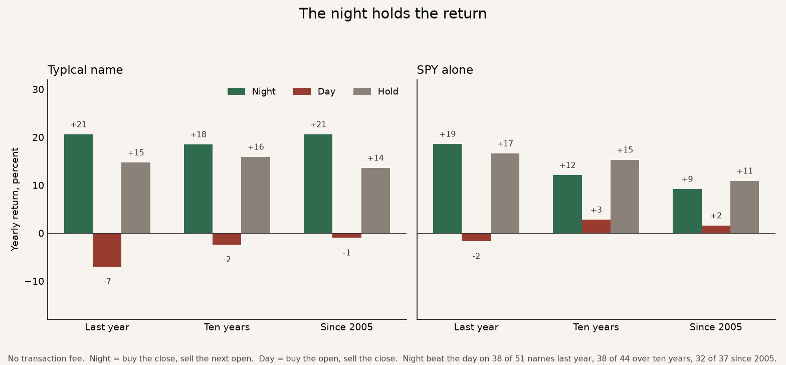

# Factor lab

Each test is a chart on this page. Open the repo and read the pictures. No transaction fee unless a chart says so.

## 2026-10-05 · The night holds the return

How one dollar grew. Green is the night, red is the day, grey is holding.

Each name over the last ten years. A green bar means the night earned more than the day.

## 2026-10-05 · Calm volume does not keep the same sign

How one dollar grew. Grey is every name. Since 2005 the jumpy third finished ahead. Over the last ten years the calm third finished ahead.

