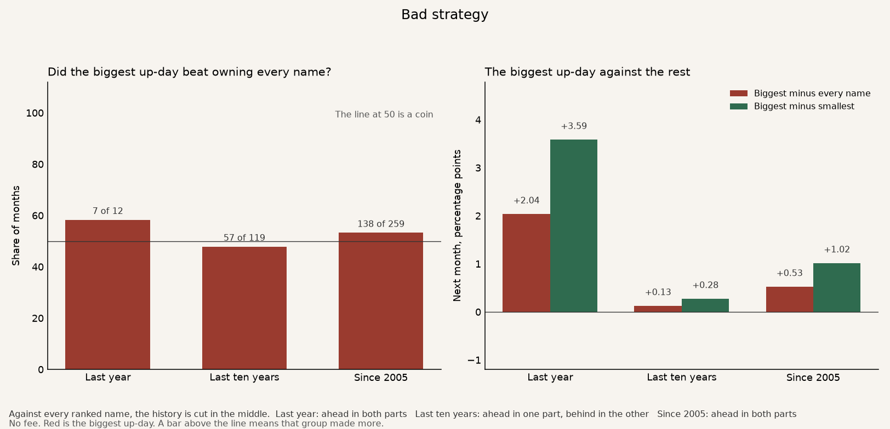
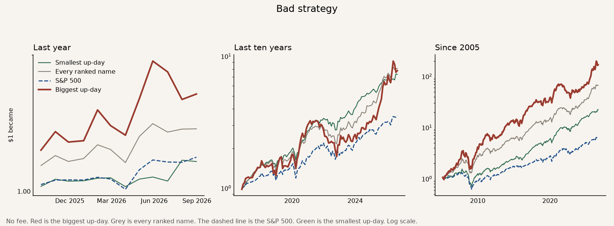

# Bad strategy

The idea is that a stock's biggest one-day gain in the month just finished points to a better next month.

The strategy is the third with that biggest up-day. Each month, hold those stocks to the next month's close. Two benchmarks sit under it. The grey line is every ranked stock, owned in equal amounts. That answers whether the sort helped. The dashed line is the S&P 500. That answers whether the result beat the market a person could have bought instead. The green line is the third whose best day was the smallest.

In the typical month, 54 of every 100 names in the biggest-up-day third were also in the jumpy third. A name picked at random from the ranked list was in the jumpy third 31 times out of 100. Across 252 months the two lists were never the same list.

A **bold** row is a judge. The strategy works on that row when it beats the benchmark on that row. More money is better. A higher Sharpe is a smoother ride. A smaller worst fall is better.

How one dollar grew. Red is the strategy. Grey is every ranked name. The dashed line is the S&P 500. Green is the smallest up-day.

## The judges

No fee. The bold rows are the strategy. The two lines under each one are the two benchmarks. The S&P line is the price index, close to close, on the same months, with dividends left out. The last finished month in the file is August 2026. The shared tape stops on 18 September 2026, so September is left out.

| | Last year | Last ten years | Since 2005 |
|---|---:|---:|---:|
| **One dollar became.** What $1 grew into. | **$1.64** | **$7.78** | **$168.14** |
| Every ranked name | $1.37 | $8.07 | $66.91 |
| S&P 500 | $1.19 | $3.54 | $6.51 |
| **Yearly return.** That same money, as a pace per year. | **+64.1%** | **+23.0%** | **+26.8%** |
| Every ranked name | +37.5% | +23.4% | +21.5% |
| S&P 500 | +19.0% | +13.6% | +9.1% |
| **Sharpe.** Higher means a smoother ride for the return you got. | **1.33** | **0.88** | **0.98** |
| Every ranked name | 1.48 | 1.19 | 1.09 |
| S&P 500 | 1.38 | 0.89 | 0.65 |
| **Worst fall.** The deepest drop from a peak. Smaller is better. | **−17.7%** | **−46.5%** | **−56.2%** |
| Every ranked name | −8.7% | −26.7% | −47.8% |
| S&P 500 | −5.9% | −24.8% | −52.6% |
| **Won in both parts.** The history is cut in the middle. Each part has to make more money than both benchmarks. | **Yes** | **No** | **Yes** |
| Every ranked name | Ahead in both parts | Ahead in one part, behind in the other | Ahead in both parts |
| S&P 500 | Ahead in both parts | Ahead in both parts | Ahead in both parts |

The last ten years are cut in the middle, after August 2021. In the earlier part one dollar became $3.15, against $2.92 from owning every name and $2.09 from the S&P 500. In the later part, September 2021 through August 2026, one dollar became $2.47, against $2.76 from owning every name and $1.70 from the S&P 500. Ahead of every name in one part, behind in the other. The two parts have to agree. They do not.

Over those ten years the average month was 0.13 percentage points ahead of owning every name, and the compounded money was behind, $7.78 against $8.07. The later part lost more than the earlier part gained. It beat the S&P 500 in both parts of every window. Every ranked name also beat the S&P, $66.91 against $6.51 since 2005, so part of that gap is this list of stocks. The list is United States and Hong Kong names.

The ride did not win. Since 2005 the Sharpe is 0.98 against 1.09 for every ranked name, and the worst fall is deeper, −56.2% against −47.8%. Over the last ten years the worst fall is −46.5% against −26.7%.

## The rest

These rows are context. They are not the judges.

| | Last year | Last ten years | Since 2005 |
|---|---:|---:|---:|
| Months | 12 | 119 | 259 |
| Months the biggest up-day beat every ranked name | 7 of 12 | 57 of 119 | 138 of 259 |
| Months the biggest up-day beat the S&P 500 | 8 of 12 | 63 of 119 | 147 of 259 |
| Biggest up-day minus every name, a month | +2.04 pp | +0.13 pp | +0.53 pp |
| Alpha. Yearly extra after crediting the extra bounce. | +1.8% | −6.0% | −0.8% |
| Beta versus every name. 1.33 means it bounced 1.33 times as much. | 1.66 | 1.33 | 1.33 |
| Smallest up-day, one dollar became | $1.16 | $7.30 | $22.26 |

The number is the biggest close-to-close gain inside the month just finished. The two closes have to fall within four days, so a missing week in the file is not counted as one day. A name needs ten such days. The rank is inside the United States and inside Hong Kong. A listing with fewer than nine names that month is not put in either third.

Since 2005 the biggest third's best day averaged 7.9%. The smallest third's best day averaged 2.2%.

Fudan Microelectronics sat in the biggest third in 173 of 259 months, and in the jumpy third in 58 of those. SMIC sat in it in 164 months, and in the jumpy third in 86. AMD sat in it in 170 months and in the jumpy third in 143. Micron sat in it in 158 and in the jumpy third in 143.

The extra money since 2005 was the extra bounce. After crediting that bounce, the leftover is about −0.8% a year. Over the last ten years the leftover is −6.0% a year.

**Bad strategy.** Since 2005 one dollar became $168, against $67 from owning every name and $7 from the S&P 500, and over the last ten years one dollar became $7.78, against $8.07 from owning every name.
