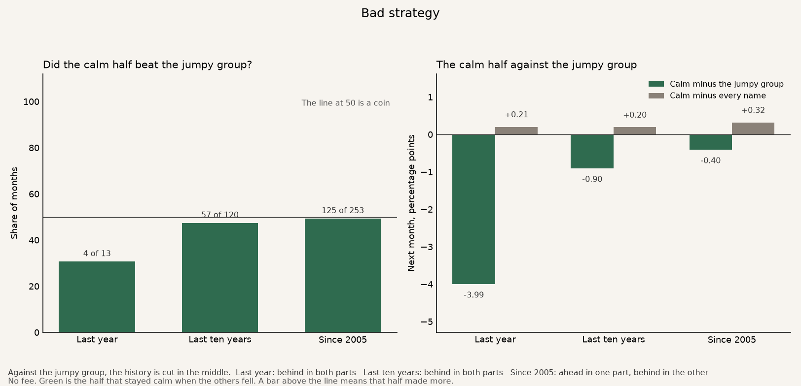
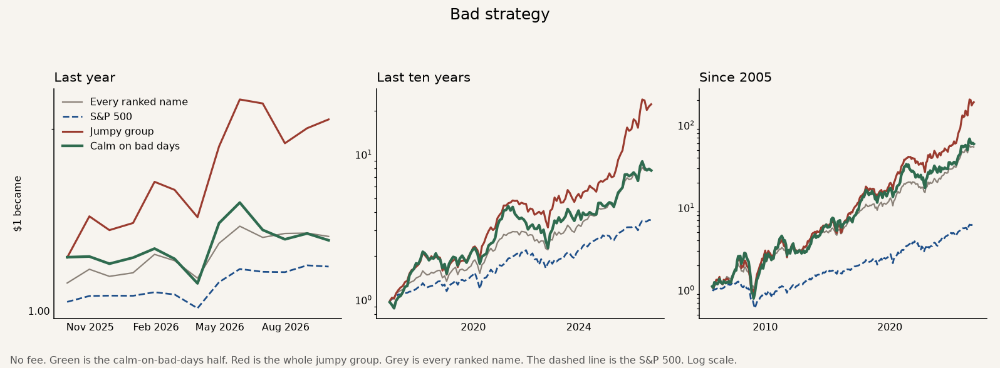

# Bad strategy

The idea is that inside the jumpy stocks, a name that stays calm on the days the others fall should be the better one to hold.

The strategy is that calmer half of the jumpy stocks. Each month, hold those names to the next month's close. The green line is that half. Three benchmarks sit under it. The red line is the whole jumpy group. That group already wins, so this cut is a new result only when the calmer half beats it. The grey line is every ranked stock, owned in equal amounts. The dashed line is the S&P 500.

A **bold** row is a judge. The strategy works on that row when it beats the benchmarks on that row. More money is better. A higher Sharpe is a smoother ride. A smaller worst fall is better.

How one dollar grew. Green is the calm half. Red is the whole jumpy group. Grey is every ranked name. The dashed line is the S&P 500.

## The judges

No fee. The bold rows are the calm half. The three lines under each one are the jumpy group, owning every ranked name, and the S&P 500. The S&P line is the price index, close to close, on the same months, with dividends left out. These are the same 253 months as the jumpy-stock page, September 2005 through September 2026, and the jumpy line is the same result.

| | Last year | Last ten years | Since 2005 |
|---|---:|---:|---:|
| **One dollar became.** What $1 grew into. | **$1.31** | **$7.76** | **$59.05** |
| Jumpy group | $2.07 | $22.13 | $189.54 |
| Every ranked name | $1.33 | $7.82 | $54.15 |
| S&P 500 | $1.18 | $3.53 | $6.27 |
| **Yearly return.** That same money, as a pace per year. | **+28.3%** | **+22.7%** | **+21.3%** |
| Jumpy group | +96.3% | +36.3% | +28.2% |
| Every ranked name | +30.0% | +22.8% | +20.8% |
| S&P 500 | +16.9% | +13.4% | +9.1% |
| **Sharpe.** Higher means a smoother ride for the return you got. | **0.83** | **0.84** | **0.76** |
| Jumpy group | 1.66 | 1.19 | 0.97 |
| Every ranked name | 1.33 | 1.19 | 1.07 |
| S&P 500 | 1.28 | 0.89 | 0.65 |
| **Worst fall.** The deepest drop from a peak. Smaller is better. | **−13.4%** | **−48.4%** | **−71.9%** |
| Jumpy group | −15.4% | −34.9% | −62.9% |
| Every ranked name | −8.7% | −25.2% | −48.9% |
| S&P 500 | −5.9% | −24.8% | −52.6% |
| **Won in both parts.** The history is cut in the middle. Each part has to make more money than the jumpy group, than every ranked name, and than the S&P 500. | **No** | **No** | **No** |
| Jumpy group | Behind in both parts | Behind in both parts | Ahead in one part, behind in the other |
| Every ranked name | Ahead in one part, behind in the other | Ahead in one part, behind in the other | Ahead in one part, behind in the other |
| S&P 500 | Ahead in one part, behind in the other | Ahead in both parts | Ahead in both parts |

The history since 2005 is cut in the middle, after February 2016. In the earlier part, September 2005 through February 2016, one dollar became $5.74, against $5.18 from the jumpy group, $4.95 from owning every name, and $1.58 from the S&P 500. In the later part, March 2016 through September 2026, one dollar became $10.28, against $36.59 from the jumpy group, $10.95 from owning every name, and $3.96 from the S&P 500. Ahead of the jumpy group in the earlier part, behind in the later part. The two parts have to agree. They do not.

Over the whole stretch since 2005 the calm half finished ahead of owning every name, $59.05 against $54.15, and the average month was 0.32 percentage points ahead. The later part was behind, $10.28 against $10.95, so the two parts do not agree there either. Over the last ten years the average month was 0.20 percentage points ahead of owning every name, and the compounded money was behind, $7.76 against $7.82. The later part of those ten years lost more than the earlier part gained.

The last ten years are cut after September 2021. In the earlier part one dollar became $3.60, against $4.53 from the jumpy group, $2.79 from owning every name, and $1.99 from the S&P 500. In the later part one dollar became $2.15, against $4.89, $2.80, and $1.78. Behind the jumpy group in both of those parts. Ahead of every name in the earlier part, behind in the later part. Ahead of the S&P 500 in both.

Over the last year one dollar became $1.31, against $2.07 from the jumpy group, $1.33 from owning every name, and $1.18 from the S&P 500.

It beat the S&P 500 in both parts of the history since 2005. Every ranked name also beat the S&P, $54.15 against $6.27, and the jumpy group beat it by more, $189.54 against $6.27. Part of that gap is this list of stocks. The list is United States and Hong Kong names.

The ride was the weaker one. Since 2005 the Sharpe is 0.76 against 0.97 for the jumpy group and 1.07 for every ranked name. The worst fall was deeper, −71.9% against −62.9% for the jumpy group and −48.9% for every name.

The calm half moved with the jumpy group, and then finished far behind it. When the jumpy group made 1% in a month, the calm half made about 0.95%. The match between the two monthly series is 0.88, and 1 would mean the same month every time. After crediting that shared bounce, the leftover is about −3.3% a year. One dollar became $59.05 against $189.54. That is a different path, and a worse one. The calm half has to beat the jumpy group in both parts. It does not, so this is not a new factor.

## The rest

These rows are context. They are not the judges.

| | Last year | Last ten years | Since 2005 |
|---|---:|---:|---:|
| Months | 13 | 120 | 253 |
| Months the calm half beat the jumpy group | 4 of 13 | 57 of 120 | 125 of 253 |
| Months the calm half beat every ranked name | 5 of 13 | 61 of 120 | 132 of 253 |
| Months the calm half beat the S&P 500 | 5 of 13 | 65 of 120 | 141 of 253 |
| Calm half minus the jumpy group, a month | −3.99 pp | −0.90 pp | −0.40 pp |
| Calm half minus every name, a month | +0.21 pp | +0.20 pp | +0.32 pp |
| Downside beta of the calm half. Higher means it fell more on the bad days. | 1.22 | 1.30 | 1.30 |
| Upside beta of the calm half. Higher means it rose more on the good days. | 1.50 | 1.55 | 1.51 |
| Downside beta of the other half | 1.93 | 1.99 | 1.96 |
| Upside beta of the other half | 2.05 | 1.78 | 1.71 |
| Share of the calm half that was also the less-jumpy half. 75 of 100 means three names in four. | 71 of 100 | 75 of 100 | 75 of 100 |
| Beta versus the jumpy group. 0.95 means a 1% jumpy month came with a 0.95% calm month. | 0.67 | 0.85 | 0.95 |
| Yearly extra after crediting the jumpy group's bounce. | −21.6% | −5.6% | −3.3% |
| Other half, one dollar became | $3.05 | $58.20 | $367.03 |

Downside beta is how much a stock moved on the days the other names fell, over the prior year. The stock itself is left out of that count. Upside beta uses only the days the other names rose. A name needs 40 of each kind of day. Every jumpy name in this file cleared that bar. The jumpy third is the same one as on the jumpy-stock page: the names that moved more than the others, ranked inside the United States and inside Hong Kong. A listing with fewer than nine names that month is not ranked. The calmer half is split inside each listing too. A listing with fewer than four jumpy names that month is not split. When a listing has an odd count, the middle name stays in the jumpy group and stays out of both the calm half and the other half.

Since 2005 the calm half's downside beta averaged 1.30 and its upside beta averaged 1.51. The other half averaged 1.96 on the way down and 1.71 on the way up. The calm half was calmer on the bad days, and it was also a little calmer on the good days. In the typical month, three of every four names in the calm half were also in the less-jumpy half of that same group. The typical calm half held about 4 names.

About 93 of every 100 names in the calm half were United States listings, against 74 of every 100 in the jumpy group.

Baidu sat in the calm half in 125 of 253 months, Micron in 84, Trip.com in 79, Alibaba in 73, Freeport in 73 and Mercado Libre in 73.

The other half, the names that also jump on the way down, turned $1 into $367.03 since 2005. In the earlier part that half finished at $2.79, behind the jumpy group's $5.18. In the later part it finished at $131.35, ahead of the jumpy group's $36.59. Over the last ten years it was ahead in both parts of that window, $6.34 then $9.18, against $4.53 and $4.89. The two parts of the history since 2005 do not agree, so that side is not a new factor on this rule either.

**Bad strategy.** Since 2005 one dollar became $59.05, against $189.54 from the jumpy group, $54.15 from owning every name, and $6.27 from the S&P 500.
