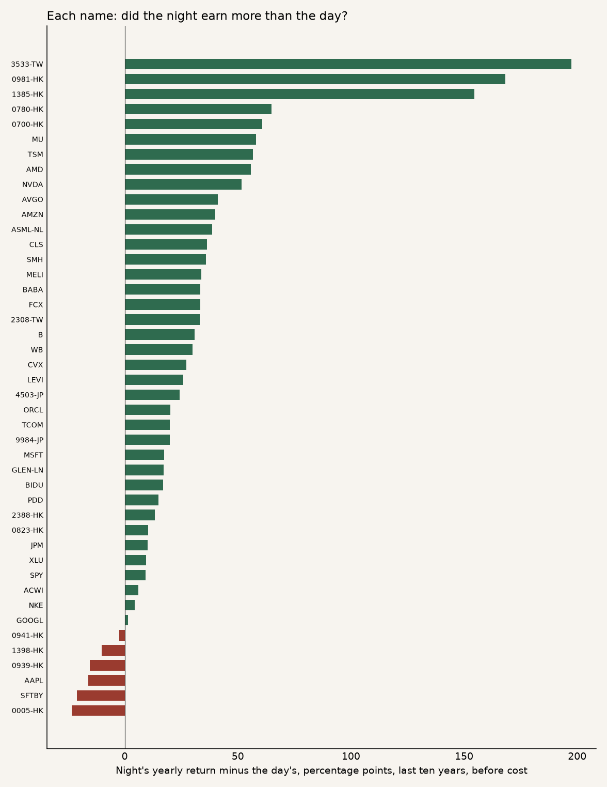

# 2026-10-05 — Night versus the trading day

## Takeaway

The return sits in the night. Buying at the close and selling at the next open beat buying at the open and selling at the close, in the last year, the last ten years, and since 2005. Both halves of the long windows agree.

Repeating that trade every day does not keep the return. A round trip costs 10 bp, and the trade does one every session. For the typical name the night then loses about 5% a year. Holding the share, and not trading, was the better result once the cost was on.

## What was tested

- Night: buy the close, sell the next open, cash while the market is open.
- Day: buy the open, sell the close, cash overnight.
- Hold: own the close the whole time. No daily trade.
- Names: the Wind daily book, forward-adjusted, through 2026-09-30. Index levels and VIX are left out. A name counts in a window only if it covers that window.
- Cost: 10 bp per round trip, paid every session the night or the day book trades. Hold pays nothing.
- The book in the chart is an equal mix, reset every day. The median name is the fairer summary. SPY is the plain reference.

Two bad prints were removed: one impossible bar in 3533-TW on 9 June 2009, and a missed 4-for-1 split in the SoftBank ADR on 8 January 2026. Dividends sit in the night, because the prices are adjusted for them.

## Typical name, before cost

Yearly return. The night beat the day on 38 of 51 names last year, 38 of 44 over ten years, and 32 of 37 since 2005.

| Window | Night | Day | Holding |
|---|---:|---:|---:|
| Last year | +20.6% | −7.0% | +14.7% |
| Last ten years | +18.5% | −2.4% | +15.9% |
| Since 2005 | +20.6% | −1.0% | +13.6% |

## Typical name, after 10 bp a day

| Window | Night | Day | Names where the night was still positive |
|---|---:|---:|---:|
| Last year | −4.8% | −26.5% | 24 of 51 |
| Last ten years | −6.4% | −22.9% | 17 of 44 |
| Since 2005 | −4.7% | −21.7% | 13 of 37 |

## SPY alone

| Window | Night | Day | Holding | Night after cost |
|---|---:|---:|---:|---:|
| Last year | +18.6% | −1.7% | +16.6% | −6.3% |
| Last ten years | +12.1% | +2.8% | +15.3% | −11.4% |
| Since 2005 | +9.2% | +1.6% | +10.9% | −13.7% |

## Equal mix of the names

Reset every day, so this climbs faster than a typical name. It is this list, not the market.

| Window | Hold | Night, before cost | Night, after cost | Worst fall, hold | Worst fall, night after cost |
|---|---:|---:|---:|---:|---:|
| Last year | +25.3% | +50.4% | +18.1% | −10.5% | −10.0% |
| Last ten years | +25.7% | +29.9% | +1.9% | −29.9% | −43.4% |
| Since 2005 | +24.9% | +27.3% | −0.2% | −53.9% | −65.8% |

Over ten years the night after cost was positive in both halves, at about +2% a year, with a deeper fall than holding. Since 2005 the first half was negative after cost, so the long window does not agree.

Over the ten years the day earned the return for six names: 0005-HK, 0939-HK, 0941-HK, 1398-HK, AAPL, and SFTBY.

## Charts

The test that produced these numbers lives in the Joywin desk at `technical/smc/overnight.py`. This file is only the record.
