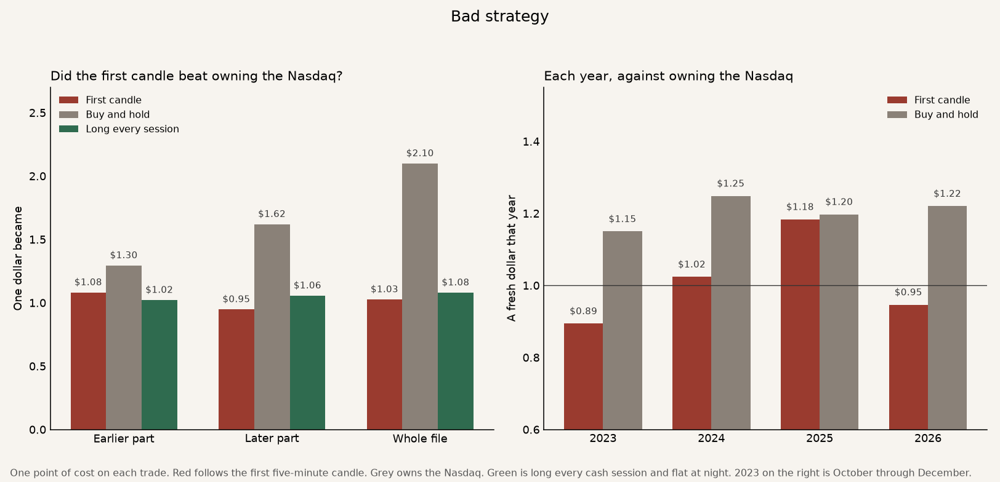
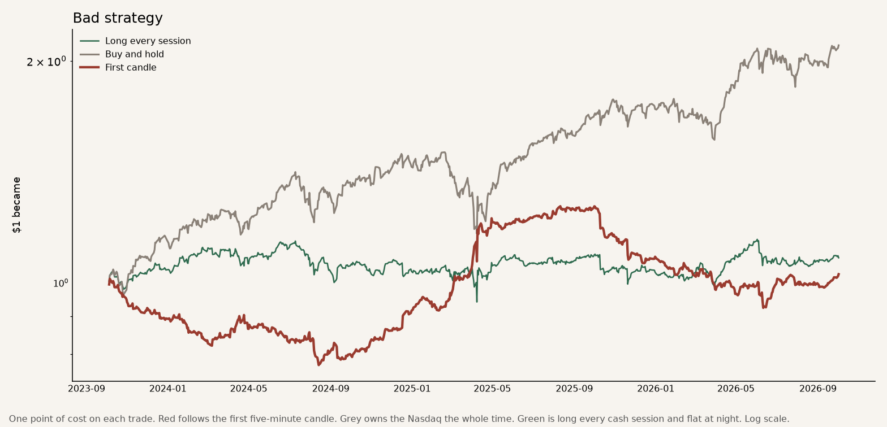

# Bad strategy

The idea is that the first five minutes after the New York open tell you whether to be long or short the Nasdaq until the cash close.

The strategy is one trade a day on the Nasdaq-100 future. The first five minutes run from 9:30 to 9:35. A higher close is a buy at that 9:35 price. A lower close is a short. The trade is closed at 4pm and is flat overnight. The grey line owns the same future the whole time, nights included, from the same starting price. The green line is long every cash session and flat at night, so the only difference from the red line is the colour of that first candle.

The file runs from 5 October 2023 to 2 October 2026. 736 trades. The years before October 2023, including 2022, are not in the file. A **bold** row is a judge. The strategy works on that row when it beats owning the Nasdaq.

How one dollar grew. Red follows the first candle. Grey owns the Nasdaq. Green is long every cash session.

## The judges

One index point of cost on each traded day. The file is cut in the middle, after 2 April 2025. Sharpe uses each day's result, and a year is counted as 252 days. A higher Sharpe is a smoother ride. The worst fall is the deepest drop from a peak. Smaller is better.

| | Earlier part | Later part | Whole file |
|---|---:|---:|---:|
| **One dollar became.** What $1 grew into. | **$1.08** | **$0.95** | **$1.03** |
| Buy and hold | $1.30 | $1.62 | $2.10 |
| Long every session | $1.02 | $1.06 | $1.08 |
| **Yearly return.** That same money, as a pace per year. | **+5.5%** | **−3.5%** | **+0.9%** |
| Buy and hold | +19.0% | +38.1% | +28.1% |
| Long every session | +1.5% | +3.8% | +2.6% |
| **Sharpe.** Higher means a smoother ride for the return you got. | **0.50** | **−0.15** | **0.13** |
| Buy and hold | 1.03 | 1.53 | 1.30 |
| Long every session | 0.18 | 0.32 | 0.26 |
| **Worst fall.** The deepest drop from a peak. Smaller is better. | **−23.6%** | **−27.2%** | **−27.2%** |
| Buy and hold | −14.6% | −12.0% | −22.5% |
| Long every session | −12.1% | −9.6% | −17.3% |
| **Won in both parts.** The history is cut in the middle. Each part has to make more money than owning the Nasdaq. | **No** | **No** | **No** |

Behind buy and hold in both parts. Through 2 April 2025 one dollar became $1.08, against $1.30 from owning the Nasdaq. After that date one dollar became $0.95, against $1.62. It has to win in both parts. It won in neither.

The cash session itself barely paid. Long every session, the same hours and the same one-point cost, turned $1 into $1.08. Following the candle turned $1 into $1.03. The candle's colour was right on 371 of 736 days. The extra dollar in buy and hold was made overnight, while this rule was flat.

## The rest

These rows are context. They are not the judges.

One R is the day's result in points, divided by the height of that first candle, after the one-point cost. The earlier part averaged +0.130R. The later part averaged −0.252R. Over the whole file the average was −0.061R and the typical day was +0.010R. A positive R leaves out the overnight move, so it can sit next to a loss against owning the Nasdaq. In October through December 2023 the average R was −1.47 while the dollars only fell from $1 to $0.89, because a small candle makes a large R.

A fresh dollar each calendar year became $0.89 in October–December 2023, $1.02 in 2024, $1.18 in 2025, and $0.95 from January through 2 October 2026. Owning the Nasdaq over those same stretches became $1.15, $1.25, $1.20, and $1.22.

Buying only when the first candle is green, and staying in cash when it is red, turned $1 into $1.07. The worst fall on that path was −15.8%. That reading also finished behind owning the Nasdaq.

The rule was in the market about 18% of the clock. On a day it trades, that is 9:35 to 4pm. It is flat overnight and on weekends. The usual candle was about 42 points tall. One point of cost is small beside that.

**Bad strategy.** One dollar became $1.03. Owning the Nasdaq turned the same dollar into $2.10. The worst fall was 27%, against 22% for owning it.
