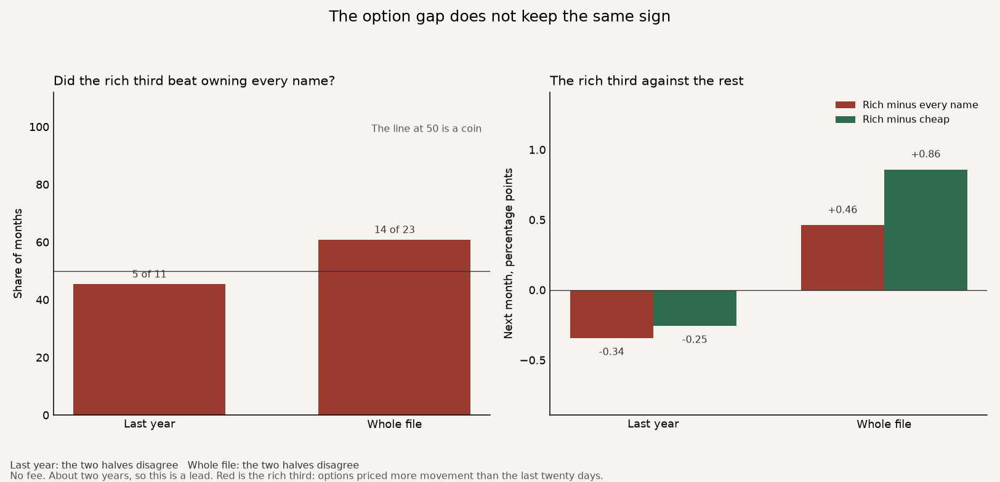
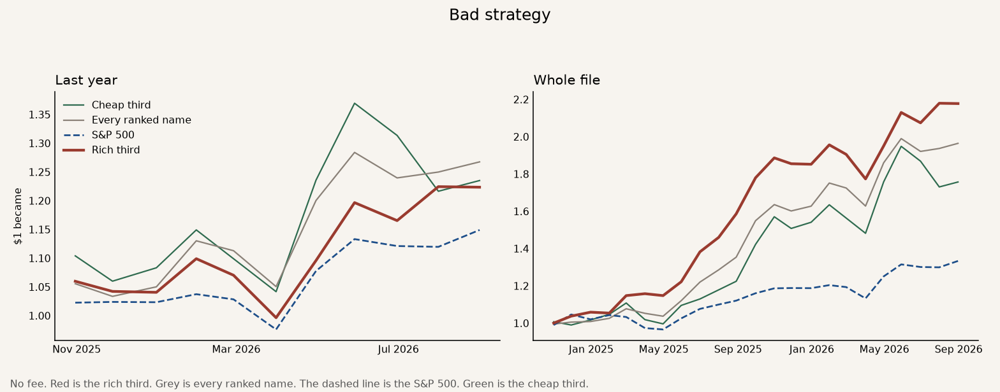

# 2026-10-05 · The option gap does not keep the same sign

The idea is that when options price more movement than a stock just had, that richness says something about the next month.

The strategy is the rich third. Each month, hold the stocks whose options priced more yearly movement than the last twenty days delivered. The grey line is every ranked name. That asks whether the sort helped. The dashed line is the S&P 500. The green line is the cheap third, where options priced less movement than the stock just had.

The file is 23 months, from September 2024 to August 2026. A **bold** row is a judge. Passing here is a lead. It is not a keep.

How one dollar grew. Red is the rich third. Grey is every ranked name. The dashed line is the S&P 500. Green is the cheap third.

## The judges

No fee. The S&P line is the price index, close to close, on the same months, with dividends left out.

| | Last year | Whole file |
|---|---:|---:|
| **One dollar became.** What $1 grew into. | **$1.22** | **$2.18** |
| Every ranked name | $1.27 | $1.96 |
| S&P 500 | $1.15 | $1.33 |
| **Yearly return.** That same money, as a pace per year. | **+24.6%** | **+50.1%** |
| Every ranked name | +29.5% | +42.2% |
| S&P 500 | +16.4% | +16.2% |
| **Sharpe.** Higher means a smoother ride for the return you got. | **1.26** | **2.34** |
| Every ranked name | 1.39 | 2.03 |
| S&P 500 | 1.17 | 1.24 |
| **Worst fall.** The deepest drop from a peak. Smaller is better. | **−9.3%** | **−9.3%** |
| Every ranked name | −7.1% | −7.1% |
| S&P 500 | −5.9% | −7.7% |
| **Both halves.** Split the history in two. The money has to beat every ranked name in both. | **No** | **No** |

The two halves disagree, so the option gap does not keep a sign. Over the whole file the rich third finished a little ahead of every name, $2.18 against $1.96, and the Sharpe was higher, 2.34 against 2.03. Over the last year it finished behind, $1.22 against $1.27, and the Sharpe was lower, 1.26 against 1.39. Rich beat cheap in 11 of 23 months. That is a coin. The worst fall was a little deeper than both benchmarks.

Against the S&P 500 the money won in both halves, and the Sharpe won in both windows. Every ranked name also beat the S&P, $1.96 against $1.33, so that gap is this list in a strong two years, not the option gap.

## The rest

The rich third was a small sleeve. 1385-HK sat in it in 22 of 23 months, 0780-HK in 19, Weibo in 16 and Grab in 15.

Across the whole file the rich third's options were about 14 percentage points of yearly volatility above the move just seen. The cheap third was about 14 points below. The return gap from that difference did not hold from one half of the file to the other.

**Bad strategy.** It beat the S&P 500, and it did not beat our benchmark, owning every name. Over the last year one dollar became $1.22, against $1.27 from owning every name.
