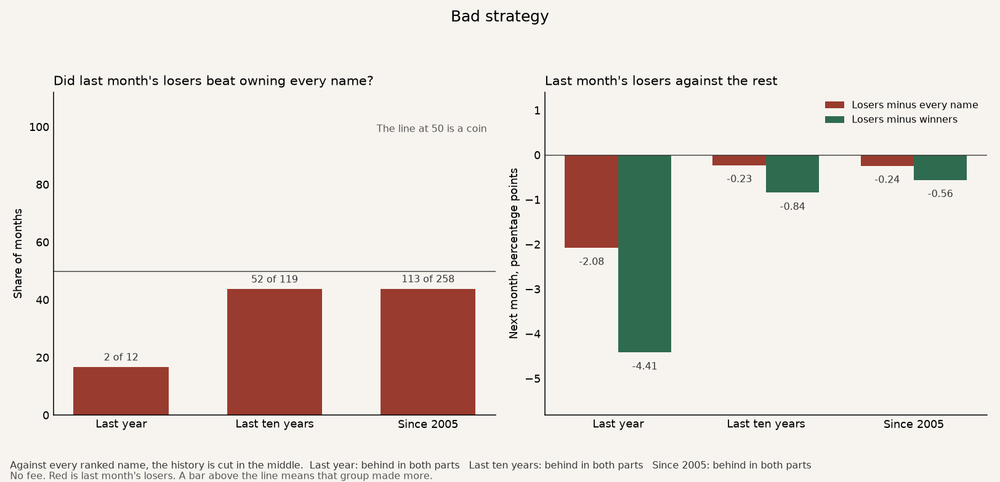
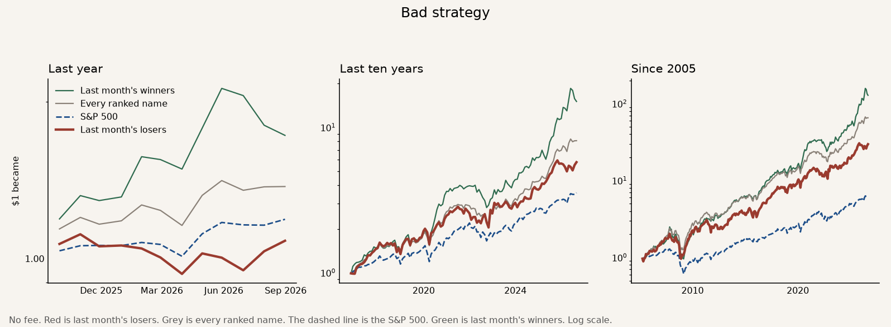

# Bad strategy

The idea is that a stock that fell last month should beat a stock that rose last month, over the next month only.

The strategy is the third that fell the most. Each month, hold those stocks to the next month's close. Two benchmarks sit under it. The grey line is every ranked stock, owned in equal amounts. That answers whether the sort helped. The dashed line is the S&P 500. That answers whether the result beat the market a person could have bought instead. The green line is the third that rose the most.

A **bold** row is a judge. The strategy works on that row when it beats the benchmark on that row. More money is better. A higher Sharpe is a smoother ride. A smaller worst fall is better.

How one dollar grew. Red is the strategy. Grey is every ranked name. The dashed line is the S&P 500. Green is last month's winners.

## The judges

No fee. The bold rows are the strategy. The two lines under each one are the two benchmarks. The S&P line is the price index, close to close, on the same months, with dividends left out. The last finished month is August 2026. The S&P series stops on 18 September 2026, and a close before the 20th is not a finished month, so September is left out.

| | Last year | Last ten years | Since 2005 |
|---|---:|---:|---:|
| **One dollar became.** What $1 grew into. | **$1.08** | **$5.76** | **$29.66** |
| Every ranked name | $1.37 | $8.10 | $65.35 |
| S&P 500 | $1.19 | $3.54 | $6.39 |
| **Yearly return.** That same money, as a pace per year. | **+8.2%** | **+19.3%** | **+17.1%** |
| Every ranked name | +37.5% | +23.5% | +21.5% |
| S&P 500 | +19.0% | +13.6% | +9.0% |
| **Sharpe.** Higher means a smoother ride for the return you got. | **0.49** | **0.87** | **0.78** |
| Every ranked name | 1.48 | 1.20 | 1.09 |
| S&P 500 | 1.38 | 0.89 | 0.65 |
| **Worst fall.** The deepest drop from a peak. Smaller is better. | **−16.0%** | **−28.1%** | **−52.9%** |
| Every ranked name | −8.6% | −26.3% | −47.8% |
| S&P 500 | −5.9% | −24.8% | −52.6% |
| **Won in both parts.** The history is cut in the middle. Each part has to make more money than both benchmarks. | **No** | **No** | **No** |
| Every ranked name | Behind in both parts | Behind in both parts | Behind in both parts |
| S&P 500 | Behind in both parts | Ahead in both parts | Ahead in both parts |

The history since 2005 is cut in the middle, after November 2015. In the earlier part, March 2005 through November 2015, one dollar became $4.00, against $6.29 from owning every name and $1.73 from the S&P 500. In the later part, December 2015 through August 2026, one dollar became $7.41, against $10.39 from owning every name and $3.69 from the S&P 500. Behind owning every name in both parts. It has to finish ahead in both. It finished ahead in neither.

Over that whole stretch the average month was 0.24 percentage points behind owning every name, and the compounded money was behind, $29.66 against $65.35. The losers beat the winners in 112 of 258 months.

The yearly test, already closed, leaves out the month just finished. Skipping the last month inside yearly momentum is a habit on this book, not a measured edge.

The last ten years are cut in the middle, after August 2021. In the earlier part, October 2016 through August 2021, one dollar became $2.72, against $2.92 from owning every name and $2.09 from the S&P 500. In the later part, September 2021 through August 2026, one dollar became $2.12, against $2.78 from owning every name and $1.70 from the S&P 500. Behind owning every name in both parts. The compounded ten years finished behind, $5.76 against $8.10.

Over the last year one dollar became $1.08, against $1.37 from owning every name and $1.19 from the S&P 500. That window is twelve months, cut after February 2026. From September 2025 through February 2026 one dollar became $1.01, against $1.24 and $1.06. From March 2026 through August 2026 one dollar became $1.08, against $1.11 and $1.12. Behind both benchmarks in both of those parts.

It beat the S&P 500 in both parts of the ten-year window and of the record since 2005. It lost to the S&P over the last year, in both parts. Every ranked name also beat the S&P, $65.35 against $6.39 since 2005, so part of that gap is this list of stocks. The list is United States and Hong Kong names.

The ride did not win. Since 2005 the Sharpe is 0.78 against 1.09 for every ranked name, and the worst fall is deeper, −52.9% against −47.8%. The S&P worst fall was −52.6%. Over the last ten years the worst fall was −28.1% against −26.3% for every name. Over the last year it was −16.0% against −8.6%.

## The rest

These rows are context. They are not the judges.

| | Last year | Last ten years | Since 2005 |
|---|---:|---:|---:|
| Months | 12 | 119 | 258 |
| Months the losers beat every ranked name | 2 of 12 | 52 of 119 | 113 of 258 |
| Months the losers beat the S&P 500 | 5 of 12 | 68 of 119 | 150 of 258 |
| Months the losers beat the winners | 2 of 12 | 52 of 119 | 112 of 258 |
| Losers minus every name, a month | −2.08 pp | −0.23 pp | −0.24 pp |
| Alpha. Yearly extra after crediting the extra bounce. | −11.5% | −4.3% | −4.8% |
| Beta versus every name. 1.09 means it bounced 1.09 times as much. | 0.61 | 1.07 | 1.09 |
| Last month's winners, one dollar became | $1.72 | $15.08 | $128.09 |

The number is the return of the month just finished: this close over the prior month's close. The next month is not in that number. The book holds that next month, then the rank is made again. The rank is inside the United States and inside Hong Kong. A listing with fewer than nine names that month is not put in either third. A month with an island print or a missed split is dropped. A close before the 20th is not a finished month. A typical month ranked 35 names.

Since 2005 the loser third had fallen 6.9% in the month just finished. The winner third had risen 11.3%.

The third that rose the most turned $1 into $128.09 since 2005, against $65.35 from owning every name and $6.39 from the S&P 500. The losers finished behind that third in both parts of the last year, the last ten years, and the record since 2005. Over the last ten years that third turned $1 into $15.08, against $8.10 and $3.54. Over the last year it turned $1 into $1.72, against $1.37 and $1.19.

Barrick sat in the loser third in 112 of 258 months, and in the winner third in 90. AMD sat in the loser third in 110 and the winner third in 103. Fudan Microelectronics sat in the loser third in 107 and the winner third in 94. Trip.com sat in the loser third in 104 and the winner third in 97. Micron sat in the loser third in 101 and the winner third in 101.

After crediting the shared bounce with owning every name, the leftover is about −4.8% a year since 2005. The loser third bounced 1.09 times as much as the whole list. Over the last ten years the leftover is −4.3% a year.

**Bad strategy.** Since 2005 one dollar became $29.66, against $65.35 from owning every name and $6.39 from the S&P 500.
