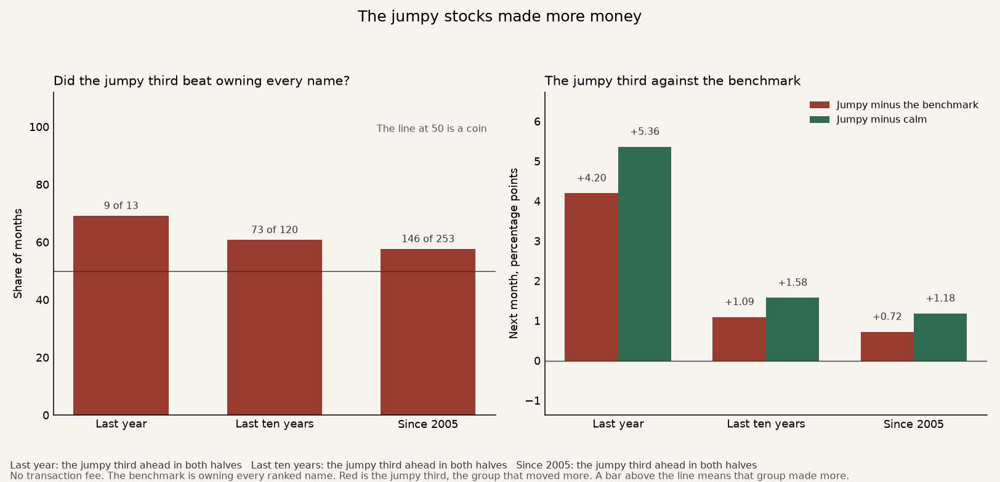
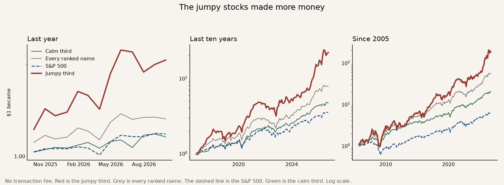

# 2026-10-05 · The jumpy stocks made more money

The idea was that a stock which usually moves less than the others is the calmer one to own, and that calm should be the better bet. On this book the jumpy stocks made more money.

The strategy is the jumpy third. Each month, hold the stocks that have been moving around more than the others. Two benchmarks sit under it. The grey line is every ranked stock, owned in equal amounts. That answers whether the sort helped. The dashed line is the S&P 500. That answers whether the result beat the market a person could have bought instead. The green line is the calm third.

A **bold** row is a judge. The strategy works on that row when it beats the benchmark on that row. More money is better. A higher Sharpe is a smoother ride. A smaller worst fall is better.

How one dollar grew. Red is the strategy. Grey is every ranked name. The dashed line is the S&P 500. Green is the calm group.

## The judges

No fee. The bold rows are the strategy. The two lines under each one are the two benchmarks. The S&P line is the price index, close to close, on the same months, with dividends left out, the same way the stocks are measured.

| | Last year | Last ten years | Since 2005 |
|---|---:|---:|---:|
| **One dollar became.** What $1 grew into. | **$2.07** | **$22.13** | **$189.54** |
| Every ranked name | $1.33 | $7.82 | $54.15 |
| S&P 500 | $1.18 | $3.53 | $6.27 |
| **Yearly return.** That same money, as a pace per year. | **+96.3%** | **+36.3%** | **+28.2%** |
| Every ranked name | +30.0% | +22.8% | +20.8% |
| S&P 500 | +16.9% | +13.4% | +9.1% |
| **Sharpe.** Higher means a smoother ride for the return you got. | **1.66** | **1.19** | **0.97** |
| Every ranked name | 1.33 | 1.19 | 1.07 |
| S&P 500 | 1.28 | 0.89 | 0.65 |
| **Worst fall.** The deepest drop from a peak. Smaller is better. | **−15.4%** | **−34.9%** | **−62.9%** |
| Every ranked name | −8.7% | −25.2% | −48.9% |
| S&P 500 | −5.9% | −24.8% | −52.6% |
| **Both halves.** Split the history in two. The money has to win in both. | **Yes** | **Yes** | **Yes** |

Against every ranked name, the money judges pass and the ride judges do not. The Sharpe ties over ten years, at 1.19, and since 2005 the whole list is smoother, 1.07 against 0.97. The worst fall was deeper every time.

Against the S&P 500, the money judges pass and the Sharpe also passes, in both halves. One dollar became $189 against $6.27 since 2005, and the Sharpe is 0.97 against 0.65. The worst fall is still deeper, −62.9% against −52.6%. The whole list also beat the S&P, $54 against $6.27, so part of that gap is this list of stocks, not only the jumpy cut. The list is United States and Hong Kong names.

## The rest

These rows are context. They are not the judges.

| | Last year | Last ten years | Since 2005 |
|---|---:|---:|---:|
| Months the jumpy third beat every ranked name | 9 of 13 | 73 of 120 | 146 of 253 |
| Months the jumpy third beat the S&P 500 | 8 of 13 | 68 of 120 | 142 of 253 |
| Jumpy third minus the benchmark, a month | +4.20 pp | +1.09 pp | +0.72 pp |
| Alpha. Yearly extra after crediting the extra bounce. | +22.6% | +3.4% | −0.4% |
| Beta versus the benchmark. 1.43 means it bounced 1.43 times as much. | 1.97 | 1.43 | 1.43 |
| Calm third, one dollar became | $1.16 | $4.68 | $19.85 |

Beta is how much a stock moved with the other names over the prior year. The stock itself is left out of that count. The rank is inside the United States and inside Hong Kong. A listing with fewer than nine names that month is not put in either third.

The calm third was a defensive sleeve. XLU sat in it in 251 of 253 months, SPY in 227, Barrick in 201, 0823-HK in 200, Nike in 193 and Chevron in 176.

The last year's +96% includes a few very large months, among them SanDisk, Micron and AMD. The ten-year window and the history since 2005 are the result.
