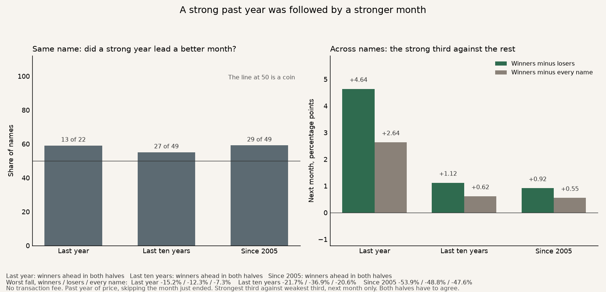
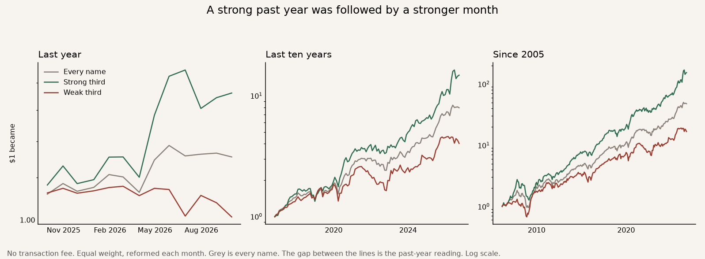

# 2026-10-05 · Momentum

The long test. A strong past year, then the next month, at the month-end close.

How one dollar grew. Green is the strong third, red is the weak third, grey is every name.

The same idea on the two-year minute tape. The market is taken out, and the trade is the next session's average price.

