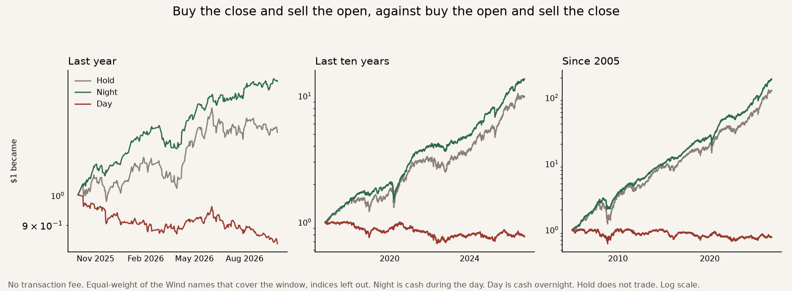

# Bad strategy

The idea is that a stock's gain arrives overnight, while the market is shut, rather than during the trading day.

How one dollar grew. Green is the night, red is the day, grey is holding.

Each name over the last ten years. A green bar means the night earned more than the day.

**Bad strategy.** It did not beat our benchmark, which is just holding the stocks. After the cost of trading every night, one dollar became $0.97, against $126 from holding.
