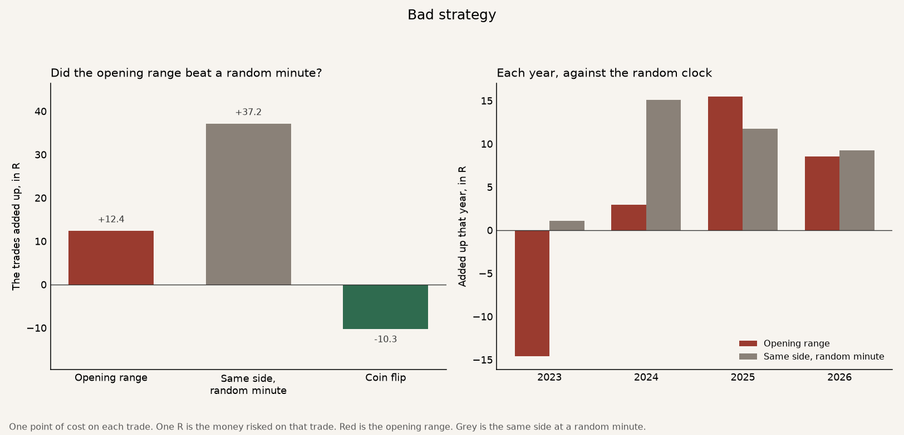
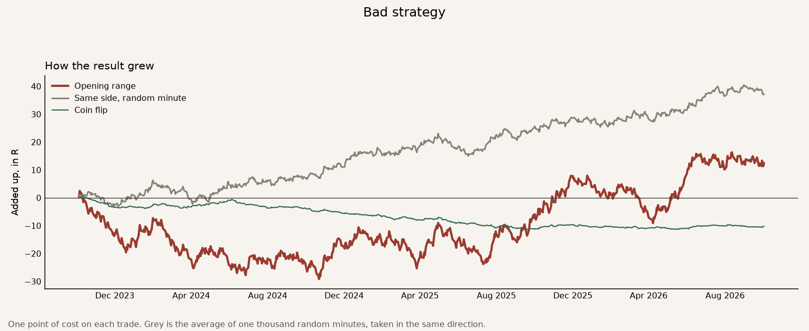

# Bad strategy

The idea is that once the Nasdaq breaks the high or low of its first fifteen minutes, that move keeps going.

The strategy is one trade a day on the Nasdaq-100 future. Mark the high and low of the first fifteen minutes. A later fifteen-minute candle that closes above is a buy. A close below is a sell. The stop is the other side. The aim is twice the money at risk. The grey line is the same buy or sell, taken at a random minute, with the same risk and the same aim. That asks whether the opening-range clock helped. The green line flips a coin for the side. One R is the money risked on that one trade.

The file runs from 5 October 2023 to 2 October 2026. 745 trades. The years before October 2023 are not in the file. A **bold** row is a judge. The strategy works on that row when it beats the grey line.

How the result grew. Red is the opening range. Grey is the same side at a random minute. Green is a coin flip.

## The judges

One index point of cost on each trade. The file is cut on 1 April 2025, the middle trade. Sharpe uses each trade's result, and a year is counted as 252 trades. A higher Sharpe is a smoother ride. The worst fall is the deepest drop from a peak, in R. Smaller is better.

| | First half | Second half | Whole file |
|---|---:|---:|---:|
| **The trades added up.** | **−21.4R** | **+33.8R** | **+12.4R** |
| Same side, random minute | +18.6R | +18.5R | +37.2R |
| Coin flip | −8.0R | −2.3R | −10.3R |
| **Per trade.** | **−0.057R** | **+0.091R** | **+0.017R** |
| Same side, random minute | +0.050R | +0.050R | +0.050R |
| Coin flip | −0.021R | −0.006R | −0.014R |
| **Sharpe.** Higher means a smoother ride for the result you got. | **−0.77** | **1.22** | **0.22** |
| Same side, random minute | 0.82 | 0.83 | 0.82 |
| Coin flip | −0.34 | −0.10 | −0.24 |
| **Worst fall.** The deepest drop from a peak. Smaller is better. | **−31.6R** | **−17.1R** | **−31.6R** |
| Same side, random minute | −13.7R | −12.6R | −16.2R |
| Coin flip | −23.7R | −20.4R | −33.6R |
| **Won in both parts.** Each part has to beat the same side at a random minute. | **No** | **Yes** | **No** |

The two parts disagree. Through 1 April 2025 the opening range lost 21.4R. The same side at a random minute made 18.6R. After that date the opening range made 33.8R and the random minute made 18.5R. It has to win in both parts. It won only in the second. Over the whole file the random minute made 37.2R and the opening range made 12.4R.

The coin flip lost money. That is a low bar. The ride still lost to the same side at a random time, on the result, on the smoothness, and on the depth of the fall.

## The rest

These rows are context. They are not the judges.

2024 on its own made +3.0R across 252 trades. The same side at a random minute made +15.1R that year. The 2023 bar on the chart is October through December only, three months, and those months lost 14.6R.

The usual stake was about 77 points. One point of cost is small beside that stake. The opening range still finished behind the random minute.

**Bad strategy.** It did not beat the benchmark, the same buy or sell at a random minute. That random clock made +37.2R. The opening range made +12.4R, and the worst fall was 31.6R.
