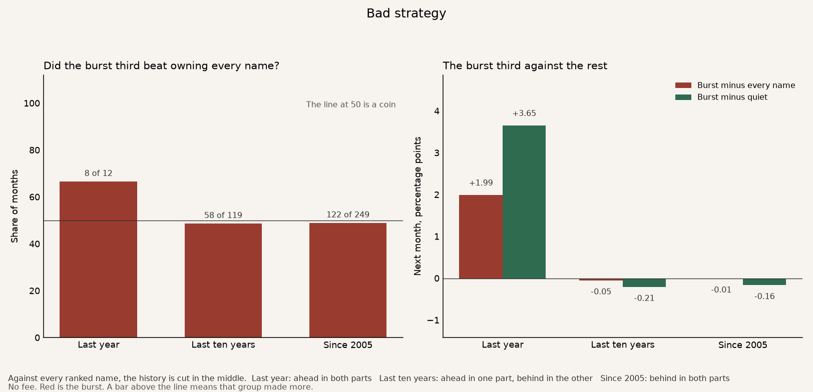
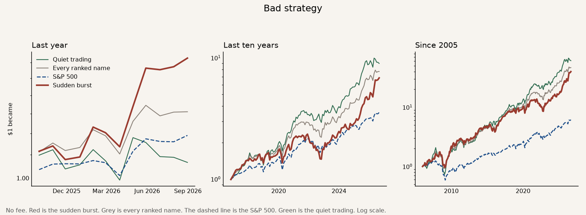

# Bad strategy

The idea is that a stock that suddenly trades much more than it usually does should beat a stock that is trading quietly.

The strategy is the third with that burst. Each month, hold those stocks to the next month's close. Two benchmarks sit under it. The grey line is every ranked stock, owned in equal amounts. That answers whether the sort helped. The dashed line is the S&P 500. That answers whether the result beat the market a person could have bought instead. The green line is the third that is trading quietly.

In the typical month, 36 of every 100 names in the burst third were also in the jumpy third. A name picked at random from the ranked list was in the jumpy third 32 times out of 100. Across 249 months the two lists were never the same list. Nine of those months shared at least two thirds of the names. This is a different list from the jumpy stocks.

A **bold** row is a judge. The strategy works on that row when it beats the benchmark on that row. More money is better. A higher Sharpe is a smoother ride. A smaller worst fall is better.

How one dollar grew. Red is the strategy. Grey is every ranked name. The dashed line is the S&P 500. Green is the quiet trading.

## The judges

No fee. The bold rows are the strategy. The two lines under each one are the two benchmarks. The S&P line is the price index, close to close, on the same months, with dividends left out. The last finished month is August 2026. The S&P series stops on 18 September 2026, and a close before the 20th is not a finished month, so September is left out.

| | Last year | Last ten years | Since 2005 |
|---|---:|---:|---:|
| **One dollar became.** What $1 grew into. | **$1.63** | **$6.83** | **$39.92** |
| Every ranked name | $1.31 | $7.72 | $46.59 |
| S&P 500 | $1.19 | $3.54 | $6.15 |
| **Yearly return.** That same money, as a pace per year. | **+63.0%** | **+21.4%** | **+19.4%** |
| Every ranked name | +31.0% | +22.9% | +20.3% |
| S&P 500 | +19.0% | +13.6% | +9.1% |
| **Sharpe.** Higher means a smoother ride for the return you got. | **1.86** | **0.99** | **0.89** |
| Every ranked name | 1.32 | 1.19 | 1.04 |
| S&P 500 | 1.38 | 0.89 | 0.65 |
| **Worst fall.** The deepest drop from a peak. Smaller is better. | **−7.7%** | **−37.8%** | **−45.1%** |
| Every ranked name | −9.4% | −25.3% | −48.3% |
| S&P 500 | −5.9% | −24.8% | −52.6% |
| **Won in both parts.** The history is cut in the middle. Each part has to make more money than both benchmarks. | **Yes** | **No** | **No** |
| Every ranked name | Ahead in both parts | Ahead in one part, behind in the other | Behind in both parts |
| S&P 500 | Ahead in both parts | Ahead in both parts | Ahead in both parts |

The history since 2005 is cut in the middle, after March 2016. In the earlier part, December 2005 through March 2016, one dollar became $4.33, against $4.77 from owning every name and $1.65 from the S&P 500. In the later part, April 2016 through August 2026, one dollar became $9.22, against $9.76 from owning every name and $3.73 from the S&P 500. Behind owning every name in both parts. It has to finish ahead in both. It finished ahead in neither.

Over that whole stretch the average month was 0.01 percentage points behind owning every name, and the compounded money was behind, $39.92 against $46.59. The burst beat the quiet third in 113 of 249 months.

The last ten years are cut in the middle, after August 2021. In the earlier part, October 2016 through August 2021, one dollar became $2.26, against $2.95 from owning every name and $2.09 from the S&P 500. In the later part, September 2021 through August 2026, one dollar became $3.02, against $2.62 from owning every name and $1.70 from the S&P 500. Ahead of every name in one part, behind in the other. The two parts have to agree. They do not. The compounded ten years finished behind, $6.83 against $7.72. The earlier part lost more than the later part gained.

Over the last year one dollar became $1.63, against $1.31 from owning every name and $1.19 from the S&P 500. That window is twelve months, cut after February 2026. From September 2025 through February 2026 one dollar became $1.20, against $1.19 and $1.06. From March 2026 through August 2026 one dollar became $1.35, against $1.10 and $1.12. Ahead in both of those parts. Twelve months do not overturn the record since 2005.

It beat the S&P 500 in both parts of every window. Every ranked name also beat the S&P, $46.59 against $6.15 since 2005, so part of that gap is this list of stocks. The list is United States and Hong Kong names.

The ride against owning every name did not win. Since 2005 the Sharpe is 0.89 against 1.04, and over the last ten years it is 0.99 against 1.19. The worst fall since 2005 was smaller, −45.1% against −48.3% for every name and −52.6% for the S&P 500. Over the last ten years the worst fall was deeper, −37.8% against −25.3%.

The quiet third made more money than the burst, and more than owning every name, over the long window. It is not a strategy to keep. The check is below.

## The rest

These rows are context. They are not the judges.

| | Last year | Last ten years | Since 2005 |
|---|---:|---:|---:|
| Months | 12 | 119 | 249 |
| Months the burst beat every ranked name | 8 of 12 | 58 of 119 | 122 of 249 |
| Months the burst beat the S&P 500 | 8 of 12 | 63 of 119 | 138 of 249 |
| Months the burst beat the quiet third | 9 of 12 | 53 of 119 | 113 of 249 |
| Burst minus every name, a month | +1.99 pp | −0.05 pp | −0.01 pp |
| Alpha. Yearly extra after crediting the extra bounce. | +18.7% | −2.4% | −1.6% |
| Beta versus every name. 1.07 means it bounced 1.07 times as much. | 1.17 | 1.08 | 1.07 |
| Quiet trading, one dollar became | $1.07 | $9.00 | $60.96 |

The number is this month's total share volume divided by that same stock's average monthly share volume over the prior twelve months. The month just finished is not part of the average. A stock needs at least ten of those twelve months. The ratio stays inside the stock, so a Hong Kong board lot is not lined up against a US share. The rank is inside the United States and inside Hong Kong. A listing with fewer than nine names that month is not put in either third. A month with an island print or a missed split is dropped. A close before the 20th is not a finished month.

Since 2005 the burst third traded 1.52 times its own usual monthly volume. The quiet third traded 0.74 times.

The quiet third turned $1 into $60.96 since 2005, against $46.59 from owning every name and $6.15 from the S&P 500. It was ahead of both in the earlier part, $5.78 against $4.77 and $1.65, and ahead of both in the later part, $10.56 against $9.76 and $3.73. Over the last ten years one dollar became $9.00, against $7.72 and $3.54. That window does not agree with itself. Through August 2021 one dollar became $3.67, against $2.95 from owning every name. From September 2021 through August 2026 one dollar became $2.45, against $2.62. Ahead in one part, behind in the other. Over the last year the quiet third finished behind, $1.07 against $1.31.

Nike sat in the burst third in 91 of 249 months, and in the jumpy third in none of those. XLU sat in it in 87 months and in the jumpy third in none. Barrick sat in it in 83 months and in the jumpy third in one. ACWI sat in it in 89 months and in the jumpy third in none. Micron sat in it in 87 months and was also jumpy in 76. Nvidia sat in it in 88 and was also jumpy in 65. Trip.com sat in it in 93 and was also jumpy in 55.

After crediting the shared bounce with owning every name, the leftover is about −1.6% a year since 2005. The burst third bounced 1.07 times as much as the whole list. Over the last ten years the leftover is −2.4% a year.

**Bad strategy.** Since 2005 one dollar became $39.92, against $46.59 from owning every name and $6.15 from the S&P 500.
